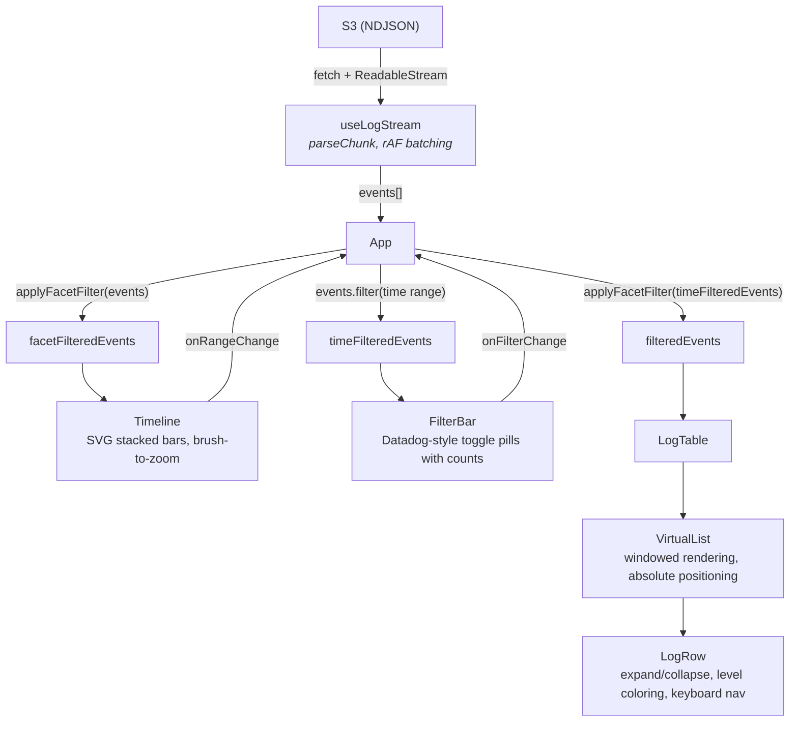

# Cribl Log Viewer

A streaming NDJSON log viewer built with React and TypeScript. Renders ~50,000 log events from S3 with virtual scrolling, an SVG timeline histogram, and faceted filtering — all without external UI or charting libraries.

> **[CodeSandbox Demo](TODO: add link before submission)**

## Quick Start

```bash
npm install
npm start        # development server at http://localhost:3000
npm test         # run all tests (128 across 13 suites)
npm run build    # production build
```

## Architecture

### Data Flow



### Key Modules

| Module             | Purpose                                                                                                                                                                                         |
| ------------------ | ----------------------------------------------------------------------------------------------------------------------------------------------------------------------------------------------- |
| `useLogStream`     | Streams NDJSON via fetch, [rAF-batched state updates](https://dev.to/tawe/requestanimationframe-explained-why-your-ui-feels-laggy-and-how-to-fix-it-3ep2), auto-retry (3x, exponential backoff) |
| `parseChunk`       | Incremental NDJSON parser with chunk-boundary buffering and `_time` validation                                                                                                                  |
| `VirtualList`      | Custom virtualizer: binary search for visible range, absolute positioning, ResizeObserver for expanded rows                                                                                     |
| `useBuckets`       | Buckets events into up to 50 time intervals using Uint32Array for efficient counting                                                                                                            |
| `useBrush`         | SVG click-and-drag interaction converting mouse coordinates to time ranges                                                                                                                      |
| `timeAxis`         | Smart tick generation snapping to round time boundaries (1s to 30d)                                                                                                                             |
| `applyFacetFilter` | Datadog-style OR-within-facet, AND-across-facets filtering                                                                                                                                      |

## Design Decisions

### Custom VirtualList (no external library)

I built the virtualizer from scratch rather than using a library like TanStack Virtual. The goal was to demonstrate a working understanding of the core techniques behind windowed rendering — not to reinvent the wheel for production use (see [Production Libraries](#production-libraries) for what I'd use in a team setting).

I researched the general concepts behind virtual scrolling before implementing, but wrote and tested all the code with AI assistance.

**How it works:**

- **Absolute positioning** with `transform: translateY()` — each row is independently placed, so expanding one row doesn't trigger a reflow of its siblings
- **Binary search** over cumulative row offsets to determine which rows fall within the current scroll viewport
- **ResizeObserver** on each expanded row — measures the actual rendered height and feeds it back into offset/total-height calculations so subsequent rows reposition correctly
- **rAF-throttled scroll handler** — coalesces rapid scroll events into a single `requestAnimationFrame` callback to avoid layout thrashing
- **Ref-based stable `renderItem`** — `LogTable` stores `events` and `timeFormat` in refs so the `renderItem` callback never changes identity, preventing unnecessary VirtualList re-renders even as data streams in

**References:**

- [TanStack Virtual](https://deepwiki.com/TanStack/virtual) — general concepts around headless virtualization
- [Virtual Scrolling for High-Performance Interfaces](https://blog.openreplay.com/virtual-scrolling-high-performance-interfaces/) — overview of windowed rendering patterns

### SVG Timeline Histogram (no charting library)

The timeline uses raw SVG with:

- **Stacked bars** color-coded by log level (error/warn/info/other)
- **Uint32Array** for O(n) bucket counting with minimal memory allocation
- **Loop-based min/max** to avoid `Math.max(...50K)` stack overflow
- **Smart time axis** that snaps ticks to human-readable intervals
- **Brush-to-zoom** interaction converting mouse coordinates to viewBox space

### Streaming Architecture

- `ReadableStream` + `TextDecoder` for incremental parsing — events render as they arrive
- Chunk-boundary buffering — correctly handles JSON objects split across network chunks
- `requestAnimationFrame` batching — coalesces rapid state updates into single render frames
- Exponential backoff auto-retry (up to 3 attempts) with `isRetryable()` classification

### Filter Strategy

Three separate filter pipelines in `App.tsx` serve different purposes:

- **Facet-only** → Timeline (sees all time ranges, respects level filter)
- **Time-only** → FilterBar counts (sees all levels, respects time range)
- **Both** → LogTable (final display)

This separation ensures the Timeline always shows the full time range and FilterBar shows accurate level counts even when filters are active. See [Known Optimizations](#known-optimizations) below.

## Tradeoffs

| Decision                           | Rationale                                           | Alternative                                                                |
| ---------------------------------- | --------------------------------------------------- | -------------------------------------------------------------------------- |
| Custom VirtualList                 | Demonstrates algorithm knowledge, zero dependencies | TanStack Virtual — first-class dynamic heights, battle-tested              |
| Hand-rolled SVG                    | Full control, ~0KB added bundle                     | Visx (Airbnb) — composable React SVG primitives with built-in brush        |
| CRA (not Vite)                     | Mature, well-understood toolchain                   | Vite — faster HMR, but CRA is sufficient for this scope                    |
| Three O(n) filter passes           | Clean separation of concerns, readable              | Single combined pass — better for >100K events                             |
| `EXPANDED_HEIGHT_ESTIMATE = 300px` | Immediate scroll positioning before measurement     | Could cause brief visual jump, resolved by ResizeObserver within one frame |

## Known Optimizations

These are areas I'd improve for production scale:

- **Single-pass filtering** — Combine the three filter passes in `App.tsx` into one loop returning a tuple, reducing 3x iteration over 50K events to 1x
- **Prefix-sum array for `getOffset`** — Current implementation is O(E) where E = expanded row count. A prefix-sum over expanded deltas would make it O(log E), improving `findStartIndex` from O(E log N) to O(log N \* log E)
- **Web Worker for parsing** — Move NDJSON parsing off the main thread to prevent any jank during streaming
- **Indexed search** — Add text search across event fields using an inverted index
- **URL-based filter state** — Encode time range and facet filters in URL params for shareability

## Production Libraries

For a production project, I'd reach for battle-tested libraries rather than hand-rolling:

- **[TanStack Virtual](https://tanstack.com/virtual)** for virtualization — headless (no DOM opinions), first-class dynamic row height support via `measureElement`, actively maintained, ~3KB gzipped
- **[Visx](https://airbnb.io/visx/)** (Airbnb) for the timeline histogram — composable React SVG primitives with built-in brush support, tree-shakeable so you only import what you need (~5-15KB)

I chose to hand-roll both for this take-home to demonstrate understanding of the underlying algorithms (binary search for visible range, ResizeObserver measurement, SVG coordinate transforms, bucket counting). In a team setting, I'd prefer proven libraries that are maintained and tested by the community.

## Longer-Term Best Practices

In a production codebase, I'd additionally set up:

- **Linting and Formatting** — ESLint (with React + TypeScript rulesets) + Prettier for consistent code style across the team
- **Pre-commit Hooks** — Husky + lint-staged to enforce linting, formatting, and type-checking before code lands in the repository
- **CI/CD Pipeline** — GitHub Actions for automated lint, type-check, test (with coverage gates), build, and deploy on every push and PR
- **Static Analysis** — SonarQube for code quality metrics, security hotspot detection, and technical debt tracking
- **E2E Testing** — Playwright for critical user flows: streaming completion, virtual scroll behavior, expand/collapse, timeline brush interaction, facet filtering
- **Bundle Analysis** — webpack-bundle-analyzer to monitor bundle size regressions as the project grows
- **Dependency Auditing** — `npm audit` in CI + Dependabot or Renovate for automated dependency updates and vulnerability alerts
- **Code Coverage Gates** — Enforce minimum coverage thresholds (e.g., 80%) in CI to prevent regression as features are added

## Testing

### Current Coverage

128 tests across 13 suites — all passing.

| Suite           | Tests | What's Covered                                                                      |
| --------------- | ----- | ----------------------------------------------------------------------------------- |
| `parseNDJSON`   | 12    | Chunk splitting, CRLF, malformed lines, buffer carry-forward, `_time` validation    |
| `formatTime`    | 11    | UTC/local formatting, edge cases, invalid input                                     |
| `useLogStream`  | 13    | Streaming, abort cleanup, auto-retry, backoff timing, manual retry                  |
| `Header`        | 12    | URL input, stats display, time toggle, loading state                                |
| `ErrorBanner`   | 5     | Display, dismiss, retry, dismiss reset on new error, accessibility                  |
| `ErrorBoundary` | 4     | Fallback UI on child throw, alert role, try again button                            |
| `LogRow`        | 12    | Expand/collapse, JSON formatting, keyboard nav, level styling                       |
| `LogTable`      | 5     | Column headers, empty state, loading state, accessibility, VirtualList rendering    |
| `VirtualList`   | 10    | Virtualization, expand/collapse, DOM node count, scroll, absolute positioning       |
| `Timeline`      | 14    | Empty state, bar rendering, brush interaction, axis labels                          |
| `timeAxis`      | 13    | Tick generation, label formatting, zero span, datetime-local format, tooltip format |
| `useBuckets`    | 8     | Time extent, level classification, single timestamp, selected range, bucket limits  |
| `FilterBar`     | 9     | Toggle pills, counts, clear all, level ordering                                     |

### What I'd Test With More Time

Given additional time, I would expand test coverage in these areas:

- **App.tsx integration tests** — Verify the three-filter pipeline: that Timeline receives facet-filtered events, FilterBar receives time-filtered events, and LogTable receives both filters applied
- **LogTable integration** — Test the wiring between LogTable, VirtualList, and LogRow, including that `renderItem` correctly passes event data and expand state
- **useBuckets unit tests** — Edge cases: empty events, single timestamp (all events at same time), very large time ranges, level classification accuracy
- **timeAxis unit tests** — `generateTimeTicks` snapping to nice intervals, `formatTickLabel` format adaptation at different zoom levels, `toDatetimeLocal` ISO formatting
- **ErrorBoundary** — Verify fallback UI renders when a child component throws during render
- **Accessibility audit** — Automated axe-core scans to verify WCAG AA compliance beyond manual contrast checks
- **Performance regression tests** — Use `performance.now()` to assert bucketing 50K events completes in <50ms, and that VirtualList renders <30 DOM nodes regardless of dataset size
- **E2E tests with Playwright** — Full user flow: load URL, wait for streaming to complete, scroll through events, expand a row, brush a time range on the timeline, toggle facet filters, verify filtered counts

## Implementation Plan

The project was built bottom-up across three phases, each validating a layer before building the next. The commit history reflects this progression.

### Phase 1: Utilities and Streaming Foundation

Established the data layer with TDD — every utility and hook was tested before being consumed by components.

| Commit                                     | What was built                                                                                                                                       |
| ------------------------------------------ | ---------------------------------------------------------------------------------------------------------------------------------------------------- |
| `a97e412` feat: initial project setup      | CRA scaffold, TypeScript config, folder structure, CSS custom properties for dark theme                                                              |
| `ffb7f76` feat: parseNDJSON and formatTime | Streaming NDJSON parser with chunk-boundary buffering, UTC/local time formatter. 22 tests written first (RED), then implemented (GREEN)              |
| `bba8d0d` feat: useLogStream hook          | `fetch` + `ReadableStream` + `TextDecoder` streaming, `requestAnimationFrame` batching, auto-retry with exponential backoff, abort cleanup. 13 tests |

**Milestone:** Data pipeline complete — can stream and parse ~50K events from S3 with correct chunk handling. All 48 tests green.

### Phase 2: UI Components and Virtual Scrolling

Built the rendering layer from leaf components up to the full app shell, then added performance-critical virtualization.

| Commit                                                     | What was built                                                                                                                                                                                      |
| ---------------------------------------------------------- | --------------------------------------------------------------------------------------------------------------------------------------------------------------------------------------------------- |
| `962943b` feat: LogRow, LogTable, Header, ErrorBanner, App | Two-column table (time + JSON), expand/collapse with animated `grid-template-rows`, URL input bar with stats, dismissible error banner. Wired everything into App. 38 tests                         |
| `7ce6375` feat: VirtualList                                | Custom virtualizer with binary search, absolute positioning, ResizeObserver for dynamic expanded heights, rAF-throttled scroll. Ref-based stable `renderItem` to prevent re-render cascade. 6 tests |

**Milestone:** Full app functional with 50K events rendering in a windowed list. Expand/collapse works with measured heights. All 92 tests green.

### Phase 3: Timeline, Filtering, and Polish

Added the bonus timeline histogram, faceted filtering, and modularized the Timeline for maintainability.

| Commit                             | What was built                                                                                                                                                                                    |
| ---------------------------------- | ------------------------------------------------------------------------------------------------------------------------------------------------------------------------------------------------- |
| `30336d8` feat: Timeline histogram | SVG stacked bars with per-level color coding, Uint32Array bucket counting, smart time axis with nice-interval snapping, brush-to-zoom interaction. 6 tests                                        |
| `b0029bc` feat: FilterBar          | Datadog-style faceted filter pills with level counts, OR-within-facet logic, three-pipeline filter orchestration in App (facet-only → Timeline, time-only → FilterBar, both → LogTable). 10 tests |
| `67db92c` refactor: split Timeline | Extracted `TimelineToolbar`, `HistogramChart`, `useBuckets`, `useBrush`, `timeAxis`, and `types` into focused modules for readability and testability                                             |

**Milestone:** All features complete — streaming, virtual scrolling, expand/collapse, timeline with brush selection, faceted filtering. 128 tests across 13 suites, all green. Clean build at 66.85 KB gzipped.
